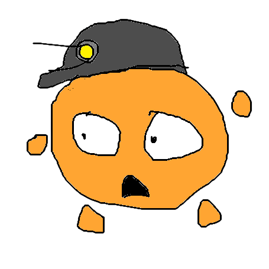

<table align="center">
<tr>
<td>
  
</td>
<td>
  <h1>amode</h1>
  <h3>he/him</h3>
</td>
</tr>
</table>

### I'm Abdurakhim Isroilov, but you can call me **amode**.[^2]

## I usually code in :
- C
- C#
- C++
- SQL
- Rust
- ~~Java~~ TSVOOPL[^1]
- Python
- Kotlin
- HTML/CSS/JS/TS.

I'm online a lot, and you can 
## talk to me 
on :
- Discord: **@amisroilov**
- Email: **amodernanimator@gmail.com**

  

- I’m currently working on **[AShell](https://github.com/amisroilov/ash)**
  
- I'm currently learning **Rust, TypeScript, SQL, and C++**
  
- Ask me about **Python**, **HTML/CSS/JS**, and **Discord bots**

  
  
  

[^1]: TSVOOPL stands for "The Shitty Verbose Object-Oriented Programming Language".
[^2]: pronounced as abode, replace b with m
